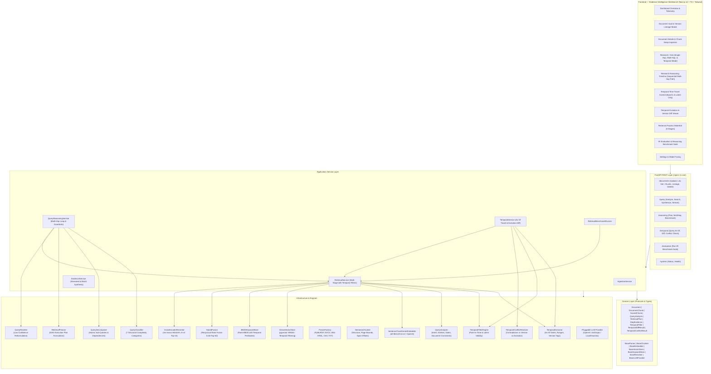

# NEXUS-RAG Architecture Documentation — Phase 1

**NEXUS-RAG** (*Neural Evidence & eXplainability Unified Search*) is a modular, production-grade evidence intelligence RAG engine designed for deep claim attribution, multi-format ingestion, hybrid retrieval, and explainable AI synthesis.

---

## 1. System Architecture Diagram

---

## 2. Ingestion Pipeline

1. **Multi-Format Extraction**:
   - **PDF**: PyMuPDF (`fitz`) parses text, extracts metadata (author, title), and inserts structural `<!-- PAGE_X -->` boundary markers.
   - **DOCX**: `python-docx` extracts paragraphs, header styles (`## Heading`), and structured markdown tables.
   - **HTML**: `BeautifulSoup4` strips scripts/styles and extracts structured semantic text.
   - **CSV**: Converts raw tabular datasets into markdown grid tables.
   - **Markdown/TXT**: Preserves header hierarchies and raw formatting.

2. **Structure-Aware Semantic Chunking**:
   - Splits on paragraph and header boundaries while maintaining sentence coherence.
   - Tracks exact token counts, character spans (`start_char`, `end_char`), page numbers, and section headers.
   - Automatically flushes and aligns chunks at page transitions for clear citation attribution.

3. **Dual-Index Registration**:
   - Dense vector embeddings generated via `SentenceTransformerEmbedder`.
   - Lexical tokenization indexed via `BM25KeywordStore`.

---

## 3. Hybrid Retrieval & Reranking Mathematics

### Reciprocal Rank Fusion (RRF)
To combine dense semantic vectors and sparse lexical keyword rankings without requiring calibrated raw score normalization:

$$RRF(d) = \sum_{m \in \{dense, sparse\}} \frac{w_m}{k + \text{rank}_m(d)}$$

Where:
- $k = 60$ (smoothing constant)
- $w_{dense} = 0.6$, $w_{sparse} = 0.4$ (configurable per query)

### Cross-Encoder Neural Reranking
Top-$K$ candidates from RRF fusion are passed to a neural Cross-Encoder (`ms-marco-MiniLM-L-6-v2`) which evaluates query-document token interactions simultaneously:

$$\text{Score}_{rerank}(q, d) = \sigma\left(\text{CrossEncoder}(q, d)\right)$$

---

## 4. Evidence Synthesis & Claim-Level Citations

- **Claim Extraction**: The synthesis engine extracts discrete factual claims from evidence passages.
- **Attribution & Spans**: Every claim is mapped to supporting citations with exact passage quotes, source document filename, page number, and chunk index.
- **Verification Status**: Each claim receives a verification tag (`supported`, `partially_supported`, `unverified`).
- **Source Reliability Matrix**: Computes weighted contribution of each source document based on retrieval confidence.
