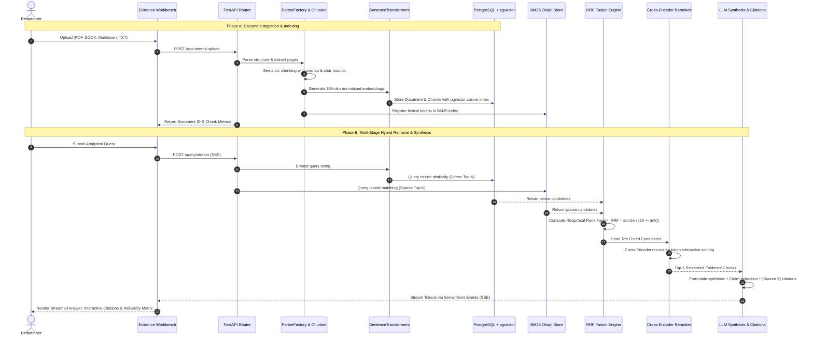

# NEXUS-RAG — End-to-End RAG Pipeline Documentation

This document describes the step-by-step mathematical and algorithmic flow of the **NEXUS-RAG** baseline pipeline implemented in Phase 1.

---

## Complete Pipeline Sequence



---

## 1. Document Ingestion & Cleaning
- **PDF**: PyMuPDF (`fitz`) parses text, extracts metadata (author, title, page numbers), and injects structural boundary tokens `<!-- PAGE_X -->`.
- **DOCX**: `python-docx` extracts paragraphs, header styles (`## Heading`), and structured markdown tables.
- **Markdown / Plaintext**: Preserves raw formatting and hierarchical headers.
- **HTML & CSV**: Converts tables into clean markdown grids and removes scripts/styles.

---

## 2. Structure-Aware Semantic Chunking
- Splitting respects sentence boundaries and Markdown headings (`#`, `##`, `###`).
- When a page marker is detected, the buffer is flushed to align chunk spans precisely with page boundaries.
- Tracks `start_char`, `end_char`, `page_number`, and `section_title` on every chunk.
- Configurable chunk size (default: 600 characters) and overlap (default: 120 characters).

---

## 3. Embeddings & Vector Storage
- **Embedding Model**: `sentence-transformers/all-MiniLM-L6-v2` generating 384-dimensional normalized vectors.
- **Database**: PostgreSQL 16 with `pgvector` extension.
- **Vector Index**: HNSW index with `vector_cosine_ops`:
  ```sql
  CREATE INDEX idx_chunks_embedding_hnsw 
  ON document_chunks 
  USING hnsw (embedding vector_cosine_ops)
  WITH (m = 16, ef_construction = 64);
  ```

---

## 4. Multi-Stage Hybrid Retrieval
1. **Dense Vector Search**: Computes cosine similarity between query embedding and chunk vectors.
2. **Sparse Keyword Search**: BM25 Okapi calculates term frequency and inverse document frequency.
3. **Reciprocal Rank Fusion (RRF)**:
   $$RRF(d) = \sum_{m \in \{\text{dense}, \text{sparse}\}} \frac{w_m}{k + \text{rank}_m(d)}$$
   $k = 60$, $w_{\text{dense}} = 0.6$, $w_{\text{sparse}} = 0.4$.

---

## 5. Neural Cross-Encoder Reranking
- Uses `cross-encoder/ms-marco-MiniLM-L-6-v2` to compute query-document cross-attention scores.
- Ranks candidate chunks based on full attention interaction.

---

## 6. Synthesis, Citations & Streaming
- Strict prompt constraints enforce that the synthesis answers exclusively from retrieved evidence without hallucination.
- Standardized citation tags:
  ```
  [Source 1] document.pdf — Page 12
  ```
- Fast real-time token streaming via `POST /query/stream` (SSE).
- Dynamic source reliability matrix scoring document credibility based on retrieval confidence.
